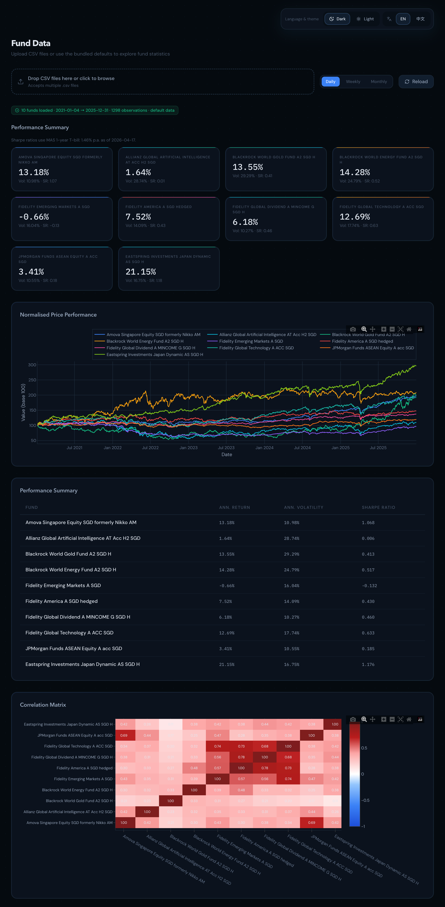
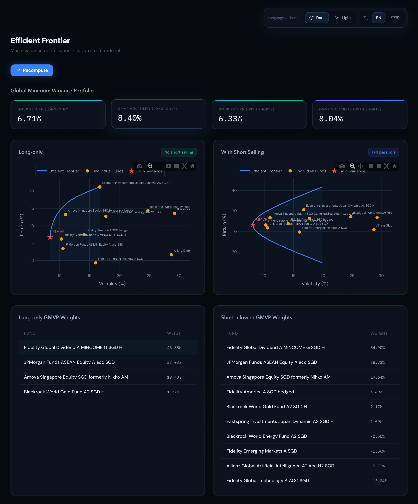
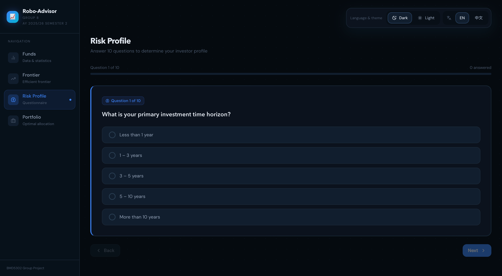
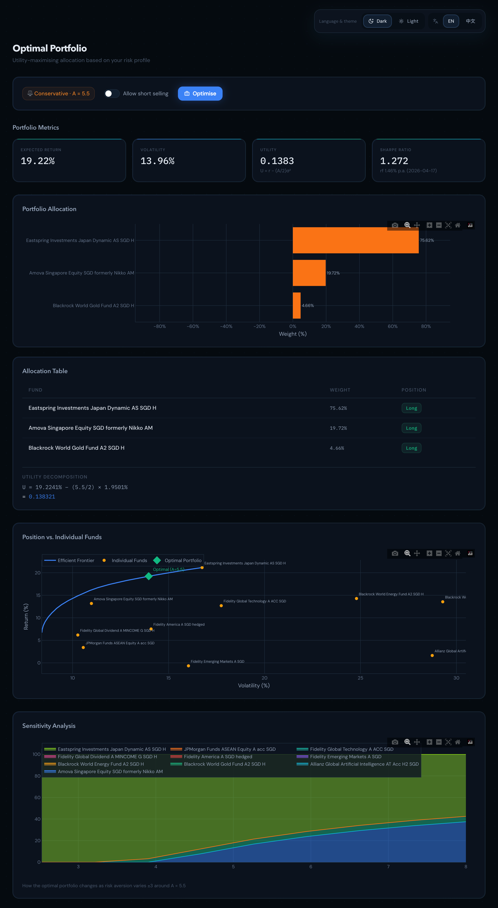

# BMD5302 Robo-Advisor Project Report

Course: BMD5302 Financial Modeling  
Project: Robot Adviser  
Academic Year: AY 2025/26 Semester 2  
Group: Group 8  
Submission file name: `[GroupNumber]BMD5302Proj1.pdf`  

Group member details:

| No. | Student name | Student ID |
| --- | --- | --- |
| 1 | [Name] | [Student ID] |
| 2 | [Name] | [Student ID] |
| 3 | [Name] | [Student ID] |
| 4 | [Name] | [Student ID] |
| 5 | [Name] | [Student ID] |

## Executive Summary

This project implements a web-based robo-advisor that applies Markowitz mean-variance portfolio theory to ten FSMOne fund products. The application loads historical fund price CSVs, computes annualised expected returns and the variance-covariance matrix, plots the efficient frontier with and without short sales, identifies the Global Minimum Variance Portfolio (GMVP), assesses investor risk tolerance through a questionnaire, and recommends the utility-maximising portfolio using:

```text
U = r - (A / 2) * sigma^2
```

where `r` is expected annualised portfolio return, `sigma^2` is annualised portfolio variance, and `A` is the investor's risk-aversion coefficient.

The implemented platform is a full web application rather than a static spreadsheet. The frontend is built with Next.js and Plotly charts, while the backend is built with FastAPI and reusable Python finance modules. The application supports default fund data from `data/`, user-uploaded FSMOne CSV files, efficient frontier visualisation, a 10-question risk profile workflow, long-only optimisation, short-allowed optimisation, and Sharpe ratios based on excess return over the MAS 1-year T-bill yield.

## Project Statement Requirements and Implementation Mapping

| Project requirement | Implementation in this repository |
| --- | --- |
| Pick 10 funds from FSMOne and download historical prices | Ten compatible FSMOne CSV files are stored in `data/`. The script `scripts/download_fsmone_funds.py` can also download the default basket for 2021-01-01 to 2025-12-31. |
| Construct average return and variance-covariance matrix | `src/data_loader.py` computes log returns, annualised expected return vector `mu`, and annualised covariance matrix `Sigma`. |
| Graph efficient frontier with and without short sales | `src/portfolio.py` computes frontiers; `frontend/app/frontier/page.tsx` displays long-only and short-allowed charts. |
| Identify individual fund points and GMVP | The Frontier page overlays individual fund points and marks GMVP for both cases. |
| Use utility function `U = r - sigma^2 A / 2` | `src/optimizer.py` maximises this objective. `src/risk_assessment.py` also provides `calculate_utility`. |
| Formulate questionnaire to determine risk aversion | `src/risk_assessment.py` defines 10 scored questions and maps total score to `A`. |
| Find and justify optimal portfolio | `/api/optimal` in `backend/main.py` calls `find_optimal_portfolio` and returns allocation, return, volatility, utility, Sharpe ratio using the MAS T-bill risk-free rate, and sensitivity analysis. |
| Develop a platform | Implemented as a Next.js plus FastAPI web platform. |
| Submit 15-minute project video | A demonstration script is provided in `docs/presentation_script_15min.md`. |

## Repository Structure and Module Functionality

```text
robo-advisor/
  backend/
    main.py
  data/
    *.csv
    README.md
  docs/
    project_report.md
    presentation_script_15min.md
    screenshots/
  frontend/
    app/
      funds/page.tsx
      frontier/page.tsx
      profile/page.tsx
      portfolio/page.tsx
      layout.tsx
      page.tsx
    components/
      Chart.tsx
      MetricCard.tsx
      Sidebar.tsx
      TopBar.tsx
    lib/
      api.ts
      i18n.ts
      store.ts
  scripts/
    download_fsmone_funds.py
  src/
    data_loader.py
    optimizer.py
    portfolio.py
    risk_assessment.py
    risk_free_rate.py
    translations.py
  README.md
  requirements.txt
```

### Backend API Layer: `backend/main.py`

The backend exposes the application logic through FastAPI:

| Endpoint | Purpose |
| --- | --- |
| `POST /api/analyze` | Loads uploaded CSVs or default CSVs from `data/`, computes returns, expected returns, covariance, normalised price series, annualised statistics, correlation matrix, and MAS T-bill risk-free-rate metadata. |
| `POST /api/frontier` | Computes efficient frontier and GMVP for `allow_short = true` or `false`. |
| `GET /api/questions` | Returns questionnaire questions and score range. |
| `POST /api/profile` | Converts a total questionnaire score into risk aversion `A` and an investor profile label. |
| `POST /api/optimal` | Computes the utility-maximising optimal portfolio, sensitivity analysis, and MAS T-bill risk-free-rate metadata used for the reported Sharpe ratio. |

The backend also enables CORS for `localhost:3000`, allowing the Next.js frontend to communicate with the API running on port 8000.

### Financial Logic Modules in `src/`

`src/data_loader.py` handles the data pipeline. It detects FSMOne CSV rows even when metadata appears above the price table, parses dates and prices, aligns multiple fund series on a common date index, forward-fills non-trading gaps, computes log returns, annualises returns and covariance, normalises prices to base 100, and generates standalone fund statistics.

`src/portfolio.py` contains the efficient frontier and GMVP logic. For short-allowed GMVP it uses the closed-form Markowitz formula:

```text
w_GMVP = Sigma^-1 1 / (1' Sigma^-1 1)
```

For long-only GMVP and frontier points it uses SLSQP numerical optimisation with `sum(w) = 1` and `0 <= w_i <= 1`. For short-allowed frontiers, weights are unbounded except for the budget constraint and target-return constraint.

`src/optimizer.py` computes the utility-maximising portfolio:

```text
max_w U = w' mu - (A / 2) * w' Sigma w
subject to sum(w) = 1
```

When shorting is not allowed, bounds are `0 <= w_i <= 1`. When shorting is allowed, no individual weight bounds are imposed, so the output can contain leveraged long and short positions. The module also builds a sensitivity table showing how allocations change as `A` varies around the investor's profile value.

`src/risk_assessment.py` defines the questionnaire, score-to-risk-aversion mapping, investor profile labels, and utility formula. The implemented questionnaire has 10 questions covering time horizon, drawdown behaviour, loss tolerance, investment objective, income stability, investment experience, emergency savings, reaction to volatile performance, proportion of savings invested, and return attitude.

`src/risk_free_rate.py` fetches and parses the MAS 1-year T-bill yield. The backend caches the fetched rate and uses it as the risk-free rate in Sharpe ratio calculations for `/api/analyze` and `/api/optimal`. If the MAS fetch is unavailable, the backend returns fallback metadata and computes Sharpe ratios with `rf = 0.0`.

`src/translations.py` contains an earlier Python-side translation dictionary. The active web frontend uses `frontend/lib/i18n.ts`.

### Frontend Modules

The frontend is a Next.js application.

| Frontend file | Functionality |
| --- | --- |
| `frontend/app/page.tsx` | Redirects root route `/` to `/funds`. |
| `frontend/app/funds/page.tsx` | CSV upload/default-data loading, frequency selection, MAS T-bill risk-free-rate note, normalised price chart, performance cards, statistics table, and correlation heatmap. |
| `frontend/app/frontier/page.tsx` | Computes and displays long-only and short-allowed efficient frontiers with individual funds and GMVP markers. |
| `frontend/app/profile/page.tsx` | Presents the questionnaire, stores answers, computes total score and risk profile, and displays the risk-aversion result. |
| `frontend/app/portfolio/page.tsx` | Computes optimal allocation, supports a short-selling toggle, displays metrics with Sharpe risk-free-rate metadata, allocation chart/table, utility decomposition, frontier overlay, and sensitivity analysis. |
| `frontend/components/Chart.tsx` | Plotly chart wrapper with shared styling. |
| `frontend/components/MetricCard.tsx` | Reusable animated metric card. |
| `frontend/components/Sidebar.tsx` | Main navigation across Funds, Frontier, Risk Profile, and Portfolio pages. |
| `frontend/components/TopBar.tsx` | Language and theme controls. |
| `frontend/lib/api.ts` | Typed fetch helpers for backend API calls. |
| `frontend/lib/store.ts` | Zustand global state for loaded fund data, risk profile, language, theme, and portfolio readiness. |
| `frontend/lib/i18n.ts` | Frontend English and Chinese labels. |

## Application Screenshots and Functionality Walkthrough

The following figures correspond to the main application screens. Where final screenshot images are unavailable, the figure captions identify the intended screen content.

### Funds Page



The Funds page is the entry point of the application. If no uploaded files are supplied, the app automatically loads the bundled CSVs from `data/`. Users can also drag and drop multiple FSMOne CSV files. The page displays the data period, observation count, annualised return, annualised volatility, Sharpe ratio, the MAS T-bill risk-free-rate note used for Sharpe, normalised price performance, and correlation matrix.

### Efficient Frontier Page



The Frontier page compares two optimisation regimes: long-only portfolios and portfolios with short sales allowed. Each chart plots volatility against return, overlays individual fund points, and marks the GMVP. The page also displays GMVP return, GMVP volatility, and the GMVP allocation weights for each regime.

### Risk Profile Page



The Risk Profile page converts investor preferences into a quantitative `A` value. A lower `A` means the investor is more risk tolerant, while a higher `A` means the investor penalises variance more heavily.

### Optimal Portfolio Page



The Portfolio page uses the investor's `A` value and the selected short-selling setting to compute the utility-maximising allocation. It displays expected return, volatility, utility, Sharpe ratio with the applied risk-free-rate note, long/short position labels, and sensitivity to changes in `A`.

## Data Selection: The 10 FSMOne Fund Products

The selected investment universe consists of ten FSMOne fund products, consistent with the project statement's requirement to select ten funds. The basket intentionally spans geographies, sectors, and investment styles so that the covariance matrix and efficient frontier have meaningful diversification effects.

| No. | Fund product | Main exposure | Reason for inclusion |
| --- | --- | --- | --- |
| 1 | Amova Singapore Equity SGD, formerly Nikko AM | Singapore equities | Provides domestic Singapore equity exposure and a local market anchor for SGD investors. |
| 2 | JPMorgan Funds - ASEAN Equity A (acc) SGD | ASEAN equities | Adds regional Southeast Asian exposure that is related to, but not identical to, Singapore equities. |
| 3 | Fidelity America A-SGD (hedged) | United States equities | Represents mature US equity exposure, hedged to SGD. |
| 4 | Eastspring Investments - Japan Dynamic AS SGD-H | Japan equities | Adds developed Asia exposure and a different country cycle from Singapore, ASEAN, and US funds. |
| 5 | Fidelity Emerging Markets A-SGD | Broad emerging markets | Adds higher-growth emerging market exposure and diversification beyond developed markets. |
| 6 | Fidelity Global Dividend A-MINCOME(G)-SGD-H | Global dividend equities | Represents lower-volatility income-oriented global equities and stabilises the portfolio. |
| 7 | Fidelity Global Technology A-ACC SGD | Global technology equities | Captures growth-oriented technology exposure. |
| 8 | Allianz Global Artificial Intelligence AT Acc H2-SGD | AI thematic equities | Adds a focused innovation theme that can behave differently from broad equity funds. |
| 9 | BlackRock World Energy Fund A2 SGD-H | Global energy equities | Adds commodity-linked sector exposure and inflation-sensitive characteristics. |
| 10 | BlackRock World Gold Fund A2 SGD-H | Gold/mining equities | Adds defensive/real-asset-linked exposure with relatively low correlation to several equity categories. |

The basket was chosen to avoid a single-market or single-sector portfolio. It includes Singapore and ASEAN local/regional funds, US and Japan developed-market funds, emerging markets, global income, high-growth technology/AI themes, and commodity-linked energy/gold funds. This breadth helps demonstrate how diversification affects the frontier, GMVP, and utility-maximising portfolios.

## Data Period and Descriptive Statistics

The bundled data were loaded from the ten CSV files in `data/`. The common aligned date range is:

```text
Start date: 2021-01-04
End date:   2025-12-31
Price observations after alignment: 1,298
Return observations: 1,297
Return frequency used for annualisation: Daily, factor = 252
```

Annualised standalone fund statistics based on log returns are shown below. The app computes each Sharpe ratio at runtime as `(annualised return - rf) / annualised volatility`, where `rf` is the fetched MAS 1-year T-bill yield.

| Fund | Annualised return | Annualised volatility | Sharpe ratio formula |
| --- | ---: | ---: | --- |
| Amova Singapore Equity SGD formerly Nikko AM | 13.18% | 10.98% | `(13.18% - rf) / 10.98%` |
| Allianz Global Artificial Intelligence AT Acc H2 SGD | 1.64% | 28.74% | `(1.64% - rf) / 28.74%` |
| BlackRock World Gold Fund A2 SGD-H | 13.55% | 29.29% | `(13.55% - rf) / 29.29%` |
| BlackRock World Energy Fund A2 SGD-H | 14.28% | 24.79% | `(14.28% - rf) / 24.79%` |
| Fidelity Emerging Markets A SGD | -0.66% | 16.04% | `(-0.66% - rf) / 16.04%` |
| Fidelity America A SGD hedged | 7.52% | 14.09% | `(7.52% - rf) / 14.09%` |
| Fidelity Global Dividend A MINCOME G SGD-H | 6.18% | 10.27% | `(6.18% - rf) / 10.27%` |
| Fidelity Global Technology A ACC SGD | 12.69% | 17.74% | `(12.69% - rf) / 17.74%` |
| JPMorgan Funds ASEAN Equity A acc SGD | 3.41% | 10.55% | `(3.41% - rf) / 10.55%` |
| Eastspring Investments Japan Dynamic AS SGD-H | 21.15% | 16.75% | `(21.15% - rf) / 16.75%` |

The Japan Dynamic fund has the highest annualised return over this period, while Global Dividend and ASEAN Equity show relatively low volatility. Emerging Markets had a slightly negative annualised return over the sample. These differences create the risk-return trade-offs used in the frontier and utility optimisation.

## Return and Covariance Methodology

For each fund, daily log returns are computed as:

```text
r_i,t = ln(P_i,t / P_i,t-1)
```

The annualised expected return vector is:

```text
mu_i = mean(r_i) * 252
```

The annualised covariance matrix is:

```text
Sigma = cov(r) * 252
```

The implementation adds a small diagonal regularisation term, `1e-8 * I`, to improve numerical stability:

```text
Sigma_regularised = Sigma + 1e-8 I
```

### Annualised Variance-Covariance Matrix

Values are in decimal return-squared units.

|  | SG Equity | AI | Gold | Energy | EM | US | Global Div | Global Tech | ASEAN | Japan |
| --- | --- | --- | --- | --- | --- | --- | --- | --- | --- | --- |
| SG Equity | 0.0121 | 0.0134 | 0.0067 | 0.0081 | 0.0075 | 0.0046 | 0.0043 | 0.0066 | 0.0080 | 0.0078 |
| AI | 0.0134 | 0.0826 | 0.0195 | 0.0225 | 0.0163 | 0.0132 | 0.0092 | 0.0188 | 0.0134 | 0.0123 |
| Gold | 0.0067 | 0.0195 | 0.0858 | 0.0240 | 0.0144 | 0.0110 | 0.0064 | 0.0103 | 0.0053 | 0.0052 |
| Energy | 0.0081 | 0.0225 | 0.0240 | 0.0615 | 0.0155 | 0.0169 | 0.0083 | 0.0142 | 0.0067 | 0.0158 |
| EM | 0.0075 | 0.0163 | 0.0144 | 0.0155 | 0.0257 | 0.0128 | 0.0093 | 0.0210 | 0.0080 | 0.0113 |
| US | 0.0046 | 0.0132 | 0.0110 | 0.0169 | 0.0128 | 0.0198 | 0.0112 | 0.0184 | 0.0042 | 0.0090 |
| Global Div | 0.0043 | 0.0092 | 0.0064 | 0.0083 | 0.0093 | 0.0112 | 0.0105 | 0.0125 | 0.0038 | 0.0075 |
| Global Tech | 0.0066 | 0.0188 | 0.0103 | 0.0142 | 0.0210 | 0.0184 | 0.0125 | 0.0315 | 0.0072 | 0.0124 |
| ASEAN | 0.0080 | 0.0134 | 0.0053 | 0.0067 | 0.0080 | 0.0042 | 0.0038 | 0.0072 | 0.0111 | 0.0067 |
| Japan | 0.0078 | 0.0123 | 0.0052 | 0.0158 | 0.0113 | 0.0090 | 0.0075 | 0.0124 | 0.0067 | 0.0280 |

### Correlation Matrix

|  | SG Equity | AI | Gold | Energy | EM | US | Global Div | Global Tech | ASEAN | Japan |
| --- | --- | --- | --- | --- | --- | --- | --- | --- | --- | --- |
| SG Equity | 1.00 | 0.42 | 0.21 | 0.30 | 0.43 | 0.30 | 0.38 | 0.34 | 0.69 | 0.42 |
| AI | 0.42 | 1.00 | 0.23 | 0.32 | 0.35 | 0.33 | 0.31 | 0.37 | 0.44 | 0.26 |
| Gold | 0.21 | 0.23 | 1.00 | 0.33 | 0.31 | 0.27 | 0.21 | 0.20 | 0.17 | 0.11 |
| Energy | 0.30 | 0.32 | 0.33 | 1.00 | 0.39 | 0.48 | 0.33 | 0.32 | 0.25 | 0.38 |
| EM | 0.43 | 0.35 | 0.31 | 0.39 | 1.00 | 0.57 | 0.56 | 0.74 | 0.47 | 0.42 |
| US | 0.30 | 0.33 | 0.27 | 0.48 | 0.57 | 1.00 | 0.78 | 0.73 | 0.28 | 0.38 |
| Global Div | 0.38 | 0.31 | 0.21 | 0.33 | 0.56 | 0.78 | 1.00 | 0.68 | 0.35 | 0.44 |
| Global Tech | 0.34 | 0.37 | 0.20 | 0.32 | 0.74 | 0.73 | 0.68 | 1.00 | 0.38 | 0.42 |
| ASEAN | 0.69 | 0.44 | 0.17 | 0.25 | 0.47 | 0.28 | 0.35 | 0.38 | 1.00 | 0.38 |
| Japan | 0.42 | 0.26 | 0.11 | 0.38 | 0.42 | 0.38 | 0.44 | 0.42 | 0.38 | 1.00 |

The correlation matrix shows why the basket is useful for portfolio construction. For example, gold has relatively low correlation with Japan, ASEAN, global technology, and Singapore equities. Global dividend and US equities are highly correlated, while Singapore and ASEAN equities are also strongly correlated, which is expected given overlapping regional exposures.

## Efficient Frontier and GMVP

For a portfolio with weights `w`, expected return and variance are:

```text
Portfolio return:   r_p = w' mu
Portfolio variance: sigma_p^2 = w' Sigma w
Portfolio volatility: sigma_p = sqrt(w' Sigma w)
```

The efficient frontier is traced by minimising variance for a sequence of target returns:

```text
min_w w' Sigma w
subject to:
  w' mu = target_return
  sum(w) = 1
```

For the long-only frontier, the additional constraint is:

```text
0 <= w_i <= 1
```

For the short-allowed frontier, the implementation removes individual weight bounds:

```text
w_i can be negative or greater than 1
```

### GMVP Results

| GMVP case | Expected return | Volatility |
| --- | ---: | ---: |
| Long-only, no short sales | 6.71% | 8.40% |
| Short sales allowed | 6.33% | 8.04% |

### Long-Only GMVP Allocation

| Fund | Weight |
| --- | ---: |
| Fidelity Global Dividend A MINCOME G SGD-H | 46.35% |
| JPMorgan Funds ASEAN Equity A acc SGD | 33.03% |
| Amova Singapore Equity SGD formerly Nikko AM | 19.40% |
| BlackRock World Gold Fund A2 SGD-H | 1.22% |

The long-only GMVP concentrates in lower-volatility and diversification-friendly funds. Global Dividend, ASEAN Equity, Singapore Equity, and a small Gold allocation reduce portfolio variance while respecting no-short constraints.

### Short-Allowed GMVP Allocation

| Fund | Weight |
| --- | ---: |
| Fidelity Global Dividend A MINCOME G SGD-H | 54.90% |
| JPMorgan Funds ASEAN Equity A acc SGD | 38.73% |
| Amova Singapore Equity SGD formerly Nikko AM | 19.64% |
| Fidelity America A SGD hedged | 4.49% |
| BlackRock World Gold Fund A2 SGD-H | 2.17% |
| Eastspring Investments Japan Dynamic AS SGD-H | 1.09% |
| Fidelity Emerging Markets A SGD | -1.56% |
| Allianz Global Artificial Intelligence AT Acc H2 SGD | -5.71% |
| Fidelity Global Technology A ACC SGD | -13.24% |

Allowing short sales slightly lowers GMVP volatility from 8.40% to 8.04%. The model achieves this by shorting some higher-volatility or covariance-heavy exposures and adding more to the lower-volatility/diversifying funds.

## Risk Assessment and Risk Aversion Mapping

The application uses a 10-question questionnaire. Each answer has a score; higher total scores indicate higher risk tolerance. The backend computes a total-score range of 14 to 48 and maps the score to `A` using:

```text
score_clamped = max(14, min(48, total_score))
normalised = (score_clamped - 14) / (48 - 14)
A = 8.0 - normalised * (8.0 - 1.0)
```

Therefore:

| Investor type | Approximate A range | Interpretation |
| --- | ---: | --- |
| Very Conservative | `A >= 7.0` | Strong preference for capital preservation and low volatility. |
| Conservative | `5.5 <= A < 7.0` | Cautious, prefers stable investments. |
| Moderate | `4.0 <= A < 5.5` | Balances growth and stability. |
| Aggressive | `2.5 <= A < 4.0` | Accepts significant volatility for growth. |
| Very Aggressive | `A < 2.5` | Pursues high returns and tolerates large drawdowns. |

Example score mapping:

| Total score | Risk aversion A |
| ---: | ---: |
| 14 | 8.00 |
| 24 | 5.94 |
| 36 | 3.47 |
| 48 | 1.00 |

This mapping creates a direct mathematical bridge between qualitative investor preferences and quantitative optimisation.

## Optimal Portfolio Construction

The optimal portfolio maximises:

```text
U = w' mu - (A / 2) * w' Sigma w
```

For an investor with total questionnaire score 24, the implemented mapping gives:

```text
A = 5.94
Profile: Conservative
```

The following sample results were computed from the bundled ten-fund dataset and the implemented `find_optimal_portfolio` function.

### Sample 1: Optimal Portfolio Without Shorting

Constraints:

```text
sum(w) = 1
0 <= w_i <= 1
```

Results for `A = 5.94`:

| Metric | Value |
| --- | ---: |
| Expected return | 18.90% |
| Volatility | 13.55% |
| Utility | 0.134444 |
| Sharpe ratio | `(18.90% - MAS 1-year T-bill yield) / 13.55%` |

| Fund | Weight | Position |
| --- | ---: | --- |
| Eastspring Investments Japan Dynamic AS SGD-H | 71.55% | Long |
| Amova Singapore Equity SGD formerly Nikko AM | 23.71% | Long |
| BlackRock World Gold Fund A2 SGD-H | 4.74% | Long |

Interpretation: Under long-only constraints, the optimiser cannot hedge by shorting. It therefore selects funds with strong risk-adjusted performance in the sample period. The allocation is concentrated in Japan Dynamic due to its high historical return and favourable volatility, with Singapore Equity and Gold adding diversification.

### Sample 2: Optimal Portfolio With Shorting Allowed

Constraints:

```text
sum(w) = 1
w_i unrestricted
```

Results for `A = 5.94`:

| Metric | Value |
| --- | ---: |
| Expected return | 75.91% |
| Volatility | 35.16% |
| Utility | 0.391990 |
| Sharpe ratio | `(75.91% - MAS 1-year T-bill yield) / 35.16%` |

| Fund | Weight | Position |
| --- | ---: | --- |
| Amova Singapore Equity SGD formerly Nikko AM | 257.64% | Long |
| Fidelity Global Technology A ACC SGD | 185.39% | Long |
| Eastspring Investments Japan Dynamic AS SGD-H | 108.94% | Long |
| BlackRock World Gold Fund A2 SGD-H | 30.39% | Long |
| BlackRock World Energy Fund A2 SGD-H | 18.96% | Long |
| Allianz Global Artificial Intelligence AT Acc H2 SGD | -33.59% | Short |
| Fidelity Global Dividend A MINCOME G SGD-H | -50.23% | Short |
| Fidelity America A SGD hedged | -51.86% | Short |
| JPMorgan Funds ASEAN Equity A acc SGD | -154.65% | Short |
| Fidelity Emerging Markets A SGD | -210.98% | Short |

Interpretation: The short-allowed model permits weights above 100% and negative weights as long as net weights sum to 100%. This creates a leveraged long-short portfolio. It has higher expected return and higher volatility than the long-only version. It is mathematically valid under the implemented unconstrained short-sale assumption, but it is less realistic for typical retail investors because it ignores leverage limits, borrowing costs, margin requirements, and short-sale availability.

For a practical client-facing robo-advisor, the long-only allocation is more suitable. The short-allowed result is useful for demonstrating the theoretical efficient frontier and the effect of relaxing constraints.

## Platform Design

The application is designed as a four-step workflow:

1. Funds: load data, inspect normalised prices, returns, volatility, MAS T-bill Sharpe ratios, and correlations.
2. Frontier: compare long-only and short-allowed efficient frontiers and GMVP allocations.
3. Risk Profile: questionnaire responses are converted into investor risk aversion `A`.
4. Portfolio: compute the utility-maximising portfolio and review allocation, metrics, utility decomposition, and sensitivity.

The state flow is:

```text
CSV files or default data
  -> /api/analyze
  -> mu, Sigma, prices, stats, correlations, risk-free-rate metadata
  -> /api/frontier for frontier and GMVP
  -> /api/questions and /api/profile for A
  -> /api/optimal for optimal allocation and Sharpe using MAS risk-free rate
```

This workflow supports the required demonstration video by showing the full process from raw price data to a personalised recommended allocation.

## Key Assumptions and Limitations

1. Historical returns and covariance are assumed to be useful estimates for future portfolio construction.
2. The default data period is 2021-01-04 to 2025-12-31 after alignment across all funds.
3. Daily log returns are used and annualised with a 252-day factor.
4. The optimiser uses nominal fund returns and does not model fees, taxes, bid-ask spreads, currency conversion costs, or fund subscription/redemption constraints.
5. The short-allowed optimiser has no leverage cap or borrowing cost. Therefore, short-allowed outputs are interpreted as theoretical optimisation results rather than directly implementable retail allocations.
6. Sharpe ratios use the MAS 1-year T-bill yield fetched by the backend. If that network fetch fails, the API returns fallback metadata and uses `rf = 0.0`.
7. The questionnaire maps behavioural responses to `A` through a linear rule. This is transparent and explainable, but not calibrated to a licensed financial advisory suitability model.
8. This is an educational financial modelling tool and not investment advice.

## Conclusion

The project meets the main requirements of the BMD5302 robot adviser assignment. It selects ten FSMOne fund products, computes annualised return and covariance inputs, visualises efficient frontiers with and without short sales, identifies GMVP allocations, maps questionnaire responses to a risk-aversion coefficient, and computes a utility-maximising optimal portfolio. The implemented web platform makes the model interactive and demonstrates how financial modelling theory can be converted into a usable digital robo-advisor workflow.

## Appendix A: Reproducibility and Execution Environment

The application can be reproduced locally with the following environment and launch commands.

Python environment setup:

```bash
python3 -m venv .venv
source .venv/bin/activate
python3 -m pip install -r requirements.txt
```

Frontend dependency setup:

```bash
cd frontend
npm install
cd ..
```

Backend launch command:

```bash
source .venv/bin/activate
python3 -m uvicorn backend.main:app --reload --port 8000
```

Frontend launch command:

```bash
cd frontend
npm run preview
```

Application URL:

```text
http://localhost:3000
```

## Appendix B: Screenshot Figure List

| Figure | Referenced file | App location | Content represented |
| --- | --- | --- | --- |
| Figure 1 | `docs/screenshots/funds-page.png` | `/funds` | Default data loaded, performance cards, normalised price chart, statistics table, and correlation heatmap. |
| Figure 2 | `docs/screenshots/frontier-page.png` | `/frontier` | Long-only and short-allowed frontier charts with GMVP markers and GMVP summary metrics. |
| Figure 3 | `docs/screenshots/profile-page.png` | `/profile` | Questionnaire result showing investor profile and risk aversion `A`. |
| Figure 4 | `docs/screenshots/portfolio-page.png` | `/portfolio` | Optimal portfolio metrics, allocation chart/table, utility decomposition, frontier overlay, and sensitivity analysis. |
